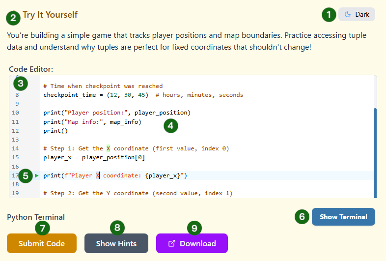
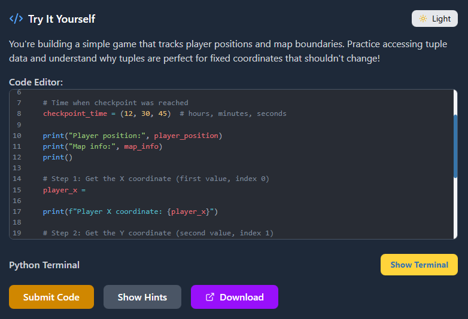
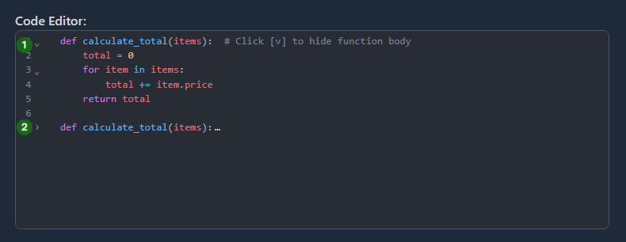

# The Code Editor ✨

Welcome to your Python playground! The code editor is where you'll write, edit, and experiment with Python code. Let's explore its powerful features designed to make coding enjoyable and efficient.

## Editor Layout



### Key Components:

1. **Theme Toggle:** Switch between light and dark mode
2. **Exercise Instructions:** Find out what coding tasks need to be carried out for you to pass the exercise
3. **Editing Area:** Where you type your Python code
4. **Code:** Example code. Note the formatting, line numbers at the side and the different colors of code (_syntax highlighting_)
5. **Terminal Toggle:** Show or hide the Python terminal (more on this next lesson)
6. **Submit Code Button:** To submit code for testing. This is how you pass an exercise
7. **Exercise Hints:** If you get stuck on an exercise you can click the _Show Hints_ button to see helpful hints
8. **Download Exercise:** If you want to use your own code editor (IDE) you can download the exercise starter code for each lesson

:::note

## Why Two Themes?

- **Light Mode:** Great for well-lit environments, reduces eye strain in bright light
- **Dark Mode:** Perfect for low-light coding sessions, many developers prefer it for longer sessions
- **Your Choice:** Switch anytime based on your preference or lighting conditions
  :::



## Syntax Highlighting

Your code is automatically color-coded based on its function. This helps you:

- **Spot errors quickly:** Incorrect syntax often breaks the color pattern.
- **Understand structure:** See the difference between code, comments, and strings at a glance.

## Intelligent Auto-complete

As you type, the editor suggests completions to save you time:

```python
# Type "pri" then press Enter
print("Hello!")  # Auto-completes to "print()"

# Type "for" then press Enter
for item in collection:  # Creates a complete loop template
    pass

```

## Code Folding

If you have a long block of code, you can "fold" it to keep your workspace clean:



1. Click the `v` next to the line number to collapse the code.
2. Click the `>` next to the line number to expand it again.

:::note
**Keep your workspace tidy:**
Use code folding to hide functions you've already finished so you can focus on the new code you're writing underneath it!
:::

## Writing Your First Code

Try typing this in the editor (we'll practice running and submitting code later on):

```python
# This is a comment - it doesn't run
print("Python is awesome!")

# Variables store data
name = "Code Explorer"
age = 25

# Print multiple things
print("Name:", name)
print("Age:", age)
```

:::tip
_Use the **COPY** button at the top right to save time. **However:** we recommend you get used to typing the code yourself_
:::

## Next Up: Running Your Code

In the next lesson, you'll learn how to execute code in the _TERMINAL_ and see the results!
