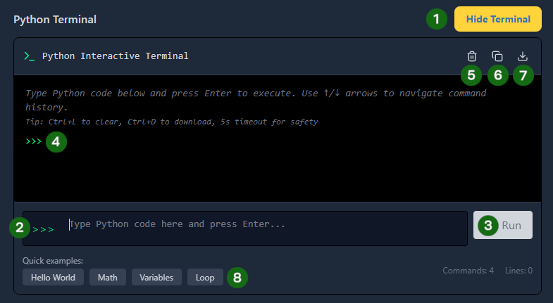

# The Python Terminal 💻

The terminal is where your code comes to life! It's an interactive Python environment that shows your program's output and any errors. In your lessons, you can open it by clicking the **Show Terminal** button below the code editor.

## What the Terminal Shows



### Terminal Sections:

|       |                     |                                                                                                                 |
| ----- | ------------------- | --------------------------------------------------------------------------------------------------------------- |
| **1** | **Terminal Toggle** | Show or hide the terminal window.                                                                               |
| **2** | **Terminal Input**  | Type individual lines of Python code here to test them instantly.                                               |
| **3** | **Run Button**      | Executes the code in the input box. The button turns green as soon as you start typing!                         |
| **4** | **Terminal Output** | This area displays the results of your code or any error messages.                                              |
| **5** | **Clear Terminal**  | Wipes the output area clean so you can start fresh. `Ctrl L` achieves the same result.                          |
| **6** | **Copy**            | Quickly copy all the text currently in the terminal to your clipboard.                                          |
| **7** | **Download**        | Save your terminal history as a text file for future reference.                                                 |
| **8** | **Quick Examples**  | Not sure what to type? Click a preset example like "Hello World" or "Loop" to see Python in action immediately. |

## Interactive Python Mode

The terminal can also work as an interactive Python shell (**REPL** - _Read-Eval-Print Loop_). This means it reads your line of code, evaluates it, and prints the result immediately.

```python
>>> 2 + 2
4
>>> "Hello" + " " + "World"
'Hello World'
>>> len("Python")
6
```

**This is perfect for:**

• Testing ideas quickly

• Checking syntax before writing full programs

• Learning by experimentation

## Understanding Output

**Normal Output**

When your code runs successfully, you will see the results of your `print()` statements:

```python
print("Success!")      # → Output: Success!
result = 10 * 5        # → Nothing shows (this stores the value)
print("Result:", result) # → Output: Result: 50
```

## Error Messages

If there's a mistake, Python provides a "Traceback" to help you fix it:

```python
print("Missing quote)   # → SyntaxError: unterminated string literal
```

An error message tells you:

1. **The Type:** (e.g., `SyntaxError` or `NameError`).
2. **The Description:** A brief explanation of what Python didn't understand.
3. **The Location:** Which line of code caused the confusion.

## Debugging with the Terminal

The terminal is your best friend for fixing errors:

1. Read the error message carefully
2. Check the line number mentioned
3. Go back to the editor and fix that line
4. Run again to see if it works

:::tip

### Testing Step-by-Step

As your code gets longer, you might only want to test the first few lines. Instead of running everything, you can use the **Gutter Button** in the Editor.

- **How it looks:** In the Terminal, you will see a blue divider line that says `PARTIAL RUN`.
- **What it means:** This confirms the Terminal stopped exactly where you clicked, ignoring any unfinished code or placeholders (`???`) below that point.
  :::

## Terminal vs Editor

| Feature     | The Editor                | The Terminal                   |
| ----------- | ------------------------- | ------------------------------ |
| Primary Use | Writing full programs     | Running and testing code       |
| Storage     | Saves your code for later | Immediate, temporary results   |
| Structure   | Many lines and functions  | Usually line-by-line execution |

## Next Up: Running Code

You now know where to write code and where to see the results. In the next lesson, we’ll learn how to bridge the two: **Running your Editor code directly into the Terminal!**
