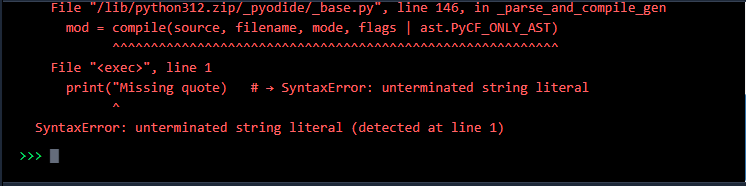

# Running Your Code 🚀

Now let's put everything together! You've seen the **Editor** (where you write) and the **Terminal** (where you see results). Now, you'll learn how to bridge them.

## The Sync: From Editor to Terminal

On this platform, the Editor and Terminal are connected.

- **Live Sync:** When you type code into the Editor, it is automatically mirrored in the Terminal's background.

- **Execution:** When you click "Run" or "Submit," you are telling the Terminal to process exactly what is currently visible in your Editor window.

## 🚦 Run vs. Submit: Know the Difference

This is the most important part of your workflow. Think of it like a rehearsal versus a live performance.

| Feature           | 🎭 Run Button (The Rehearsal)                                                              | 🎯 Submit Button (The Performance)                                     |
| ----------------- | ------------------------------------------------------------------------------------------ | ---------------------------------------------------------------------- |
| **Purpose**       | Testing and experimenting                                                                  | Proving you've solved the exercise                                     |
| **Result**        | Code executes in the terminal so you can check for bugs or see if calculations are correct | System verifies your answer after you type your solution in the editor |
| **XP & Progress** | No XP awarded, lesson not marked complete                                                  | Awards **XP** points and unlocks the next lesson                       |
| **When to Use**   | Constantly! Every few lines to make sure everything works                                  | Only once you're happy with the output from "Run"                      |

**Pro Tip:** Professional developers run their code every few lines to make sure everything is working as expected. Get into this habit early!

## Understanding Execution Flow

Python is like a recipe; it runs from **top to bottom**, one line at a time:

```python
print("Step 1: Preparing ingredients")  # Runs first
timer = 30                              # Runs second
print(f"Step 3: Set timer to {timer}")  # Runs third
```

Order matters! If you try to use a variable before you define it, Python will get confused and throw an error.

## Error Messages Are Your Friends 🚨

If your code has a typo, Python won't just sit there—it will tell you exactly what's wrong.

```python
print("Hello World"  # Missing a closing parenthesis!
```

Running this will show:



**How to handle errors:**

1. Don't Panic: Every developer sees dozens of errors a day.
2. Read the bottom line: That's usually where the "Type" of error is (e.g., `NameError`).
3. Check the line number: Python tells you exactly where it got stuck.

## Practice Run

Copy this code into your editor and click **Run** (not Submit yet!):

```python
# Simple greeting program
name = "Code Explorer"
print(f"Hello, {name}!")

# Simple calculation
apples = 5
oranges = 3
print(f"Total fruit: {apples + oranges}")
```

Once you see the results in the terminal, you're ready to move on!

## Pro Tip 💡

- **Keyboard Shortcut:** Press `Ctrl + Enter` (or `Cmd + Enter` on Mac) to "Run" instantly. Make sure you do this from the _TERMINAL_ not the _EDITOR_.

- **Print is King:** If nothing happens when you click Run, check if you used a `print()` statement. Python calculates things silently unless you tell it to "speak."

- **Fix one at a time:** If you have five errors, just fix the first one and run the code again. Often, fixing the first error can solve the rest!

## What's Next?

Now that you know how to run and test code, let's look at how the course is structured and how you can track your journey to becoming a Python Master!
