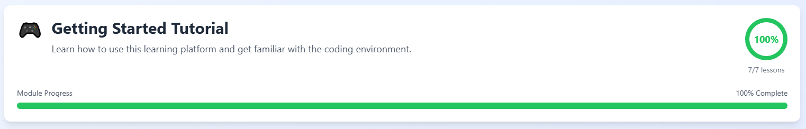
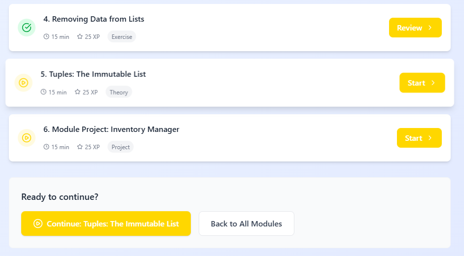

# Navigation & Progress 📊

Learn how to move through the course, track your achievements, and master the learning structure of the platform.

## The Learning Path

Your journey to becoming a Python developer is organized into a clear hierarchy.

**1. Phases (The Big Picture)**
The course is divided into three major Phases:

- **Phase 1: Fundamentals** _(Modules 1-10)_: Master the basics like variables, loops, and functions.

- **Phase 2: Intermediate** _(Modules 11-15)_: Dive into Object-Oriented Programming (OOP) and professional tooling.

- **Phase 3: Advanced Applications** _(Modules 16-20)_: Build real-world applications using APIs, Databases, and Data Science.

**2. Modules (The Milestones)**

Each Phase contains several _Modules_. A Module focuses on one specific topic (e.g., "Data Structures").

- To "complete" a module, you must finish all of its lessons.

- Completing all lessons unlocks the **Module Quiz**, which grants a large XP bonus!

**3. Lessons (The Daily Steps)**
Inside each module are 5-6 lessons. These are your bite-sized learning units, consisting of:

- 📚 **Theory:** Learn concepts through interactive explanations and live code examples.

- 💻 **Exercise:** Put theory into practice with coding challenges. You'll use the **Run** button to test and the **Submit** button to verify your solution.

- ❓ **Lesson Quiz:** Confirm your mastery with a quick check for understanding after each exercise.

- 🏆 **Project:** Larger, "Boss Level" challenges at the end of modules that combine everything you've learned into one working program.

- 🎓 **The Grand Finale** _(Module 20):_ Once you reach the end, the entire final module is dedicated to your **Capstone Project** - a fully functional Command Line Tool that integrates APIs, Databases, and Logic into one professional utility.

## Understanding Your Progress Indicators

The platform uses three distinct systems to help you track where you are and what you've accomplished. Here's how each one works:

### 1. Module Progress Bar

**Location:** Top of every Module page

**What it shows:** A visual representation of how many lessons you've completed in the current module.

**How it works:** The bar fills incrementally with each completed lesson. When it reaches 100%, you've finished all lessons in that module and unlocked the Module Quiz.

**Why it matters:** This is your real-time indicator of module completion. Use it to see how close you are to unlocking the quiz and moving to the next module.

### 2. Lesson Status Icons

**Location:** Lesson list within each Module page

**What they show:** The completion status of individual lessons.

**Icon meanings:**

- **Green Checkmark (✓):** You've successfully completed this lesson. You can revisit it anytime for review.
- **Locked Icon (🔒):** This lesson or module isn't available yet. You must complete earlier content to unlock it.
- **No Icon:** This lesson is available but not yet completed.

**Pro Tip:** Enable _Review Mode_ on any completed lesson to practice without affecting your score or progress.

### 3. XP & Reward System

**What it is:** A gamified point system that tracks your overall learning journey across the entire course.

**How you earn XP:**

- Completing lessons: Small XP reward
- Solving exercises: Medium XP reward
- Finishing quizzes: Medium XP reward
- Completing projects: Large XP reward
- Acing Module Quizzes: Bonus XP

**Where to view it:** Your Profile page shows total XP, current Level, and all collected achievements.

**Additional Rewards:**

| Reward Type         | Description                                                       | How to Track                                         |
| ------------------- | ----------------------------------------------------------------- | ---------------------------------------------------- |
| **Streaks 🔥**      | Consecutive days of learning (complete at least one lesson daily) | Visible on your Profile dashboard                    |
| **Skill Badges 🏅** | Special achievements for milestones                               | Unlocked automatically and displayed in your Profile |

**Example Badges:**

| Badge           | How to Earn                                        |
| --------------- | -------------------------------------------------- |
| Quick Learner   | Finish 5 lessons in 24 hours                       |
| Weekend Warrior | Keep the grind going on Saturday and Sunday        |
| Bug Hunter      | Solve an exercise on your first try after an error |

## How It All Connects

Think of it this way:

- **Progress Bar** = Short-term goal (current module completion)
- **Lesson Icons** = Micro-level tracking (individual lesson status)
- **XP & Badges** = Long-term achievement (overall course mastery)

Each system serves a different purpose, but together they give you a complete picture of your learning journey from daily tasks to major milestones.

## Pro Tip 💡

1. **Follow the Sequence:** Lessons are designed to build on top of one another.
2. **Use the Sidebar:** The sidebar allows you to jump between modules quickly if you need to refresh your memory on an old topic.
3. **Check your Profile:** Visit your Profile page to see your total XP, current Level, and collected Badges.

## What's Next?

Now that you know how to navigate the "Game," it's time to learn how to take your skills off the platform. In the next lesson, we'll show you how to set up **Python on your own computer!**
