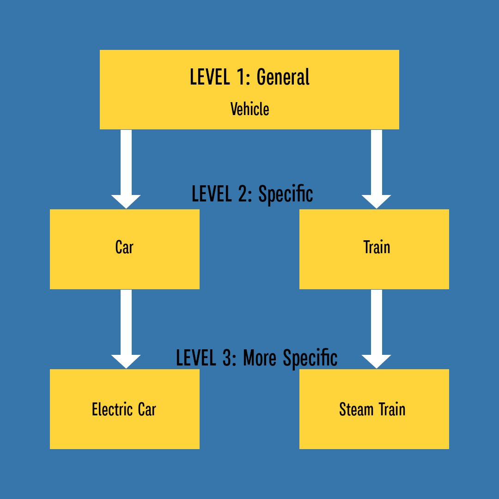

# 🧑‍🤝‍🧑 Introduction to Inheritance

**Inheritance** is one of the pillars of Object-Oriented Programming (OOP). It allows you to define a new class based on an existing class, inheriting all of its attributes and methods.

This mechanism promotes **Code Reusability** and establishes a clear "is-a" relationship (e.g., a Dog **_is a_** Mammal; a Car **_is a_** Vehicle).

## 1. Parent and Child Classes

• **Parent Class (Base Class / Superclass)**: The original class whose features are inherited.

• **Child Class (Derived Class / Subclass)**: The new class that inherits from the parent. It gets all the parent's features and can add its own unique features.

## 2. Implementing Inheritance

In Python, you specify inheritance by including the parent class name in parentheses when defining the child class.

**Example**: A basic `Animal` hierarchy

```python
# Parent Class (Base Class)
class Animal:
    def __init__(self, name):
        self.name = name
        self.age = 0

    def eat(self):
        print(f"{self.name} is eating.")

# Child Class (Subclass) inheriting from Animal
# Dog automatically receives the 'name', 'age' attributes, and the 'eat' method
class Dog(Animal):
    def bark(self):
        print(f"{self.name} says Woof!")

# Instantiation
my_dog = Dog("Porthos")

# Accessing inherited attribute
print(f"Dog's name: {my_dog.name}") # Inherited from Animal

# Calling inherited method
my_dog.eat() # Inherited from Animal

# Calling unique child method
my_dog.bark()
```

## 3. The `object` Class

In Python, all classes implicitly inherit from the built-in `object` class.

```python
# These two class definitions are equivalent:
class MyClass:
    pass

class MyClass(object):
    pass
```

This ensures that all Python objects inherit fundamental behaviors like `__init__`, `__str__`, and `__repr__`.

## 4. Class Hierarchies

Inheritance is often used to build a hierarchy, moving from general concepts to more specific ones.



Inheritance allows `ElectricCar` to use methods defined in both `Car` and `Vehicle`, while only needing to define what makes it specifically "Electric" (like battery capacity).

In the next lesson, we will focus on how to correctly initialize attributes in the child class while still ensuring the parent class's `__init__` method runs, using the crucial `super()` function.

:::summary

- **Inheritance** allows a new class (child) to inherit attributes and methods from an existing class (parent)
- Creates an **"is-a" relationship**: A Dog **is an** Animal, a Car **is a** Vehicle
- **Parent class** (base/superclass): The original class being inherited from
- **Child class** (derived/subclass): The new class that inherits from the parent
- Syntax: `class ChildClass(ParentClass):` defines inheritance
- Child classes automatically receive **all** attributes and methods from the parent
- Child classes can add their **own unique** attributes and methods
- All Python classes implicitly inherit from the built-in `object` class
- Inheritance promotes **code reusability** - write once, use in multiple classes
- Class hierarchies can be built from **general → specific** (Vehicle → Car → ElectricCar)

:::
