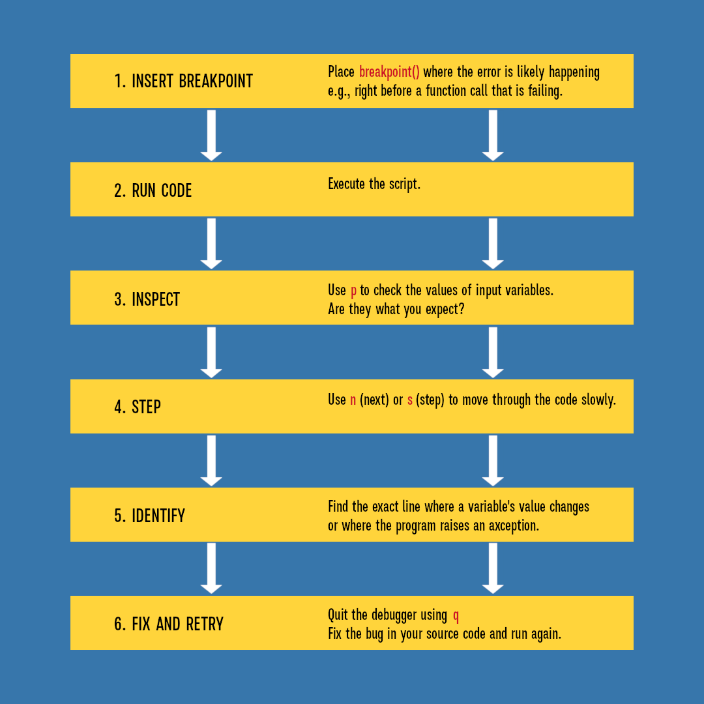

# 🐛 Basic Debugging with `pdb`

Debugging is the systematic process of finding and fixing bugs in your code. Python comes with a powerful, interactive source code debugger called `pdb` (**Python Debugger**). Using `pdb` allows you to pause execution, step through code line-by-line, and inspect variable values.

## 1. Entering the Debugger

The simplest way to use `pdb` is to insert a breakpoint directly into your code where you suspect a problem might occur.

:::note

### How to set a breakpoint:

1. **For Python 3.7+**: Use the built-in function `breakpoint()`.

2. **Older versions or General Use**: `import pdb; pdb.set_trace()`
   :::

When Python executes the line containing `breakpoint()` or `pdb.set_trace()`, it pauses and drops you into the (`Pdb`) interactive shell.

## 2. Essential `pdb` Commands

Once inside the (`Pdb`) shell, you use short commands to control the execution flow and inspect the program state.

| Command | Short Form | Function                                                                   |
| ------- | ---------- | -------------------------------------------------------------------------- |
| `n`     | `next`     | Continues execution to the next line in the current function.              |
| `s`     | `step`     | Steps into a function call. Use this to dive deeper into custom functions. |
| `c`     | `continue` | Continues execution until the next breakpoint or the end of the program.   |
| `p`     | `print`    | Prints the value of a variable or expression. (`p my_variable`)            |
| `l`     | `list`     | Lists the code surrounding the current line.                               |
| `q`     | `quit`     | Terminates the debugger and the program immediately.                       |

## 3. The Debugging Workflow

A typical debugging session using `pdb` involves:



### Example 1: Finding a Division by Zero

```python
def calculate_average(numbers):
    total = sum(numbers)
    count = len(numbers)

    # 🚩 We suspect a bug here. Let's pause and check our math.
    breakpoint()

    return total / count

# This works! (30 / 3 = 10.0)
print(calculate_average([10, 10, 10]))

# This will crash! (0 / 0 = Error)
print(calculate_average([]))
```

### What happens in the terminal?

When the second call runs, Python pauses. You can now type:

1. `p total` → Output: `0`
2. `p count` → Output: `0`
3. **The Diagnosis:** "Ah! I am trying to divide zero by zero. I need to add an `if not numbers:` check at the start."

### Example 2: Tracing a Loop Bug

```python
def find_max(numbers):
    max_num = 0
    for num in numbers:
        breakpoint()  # Pause each iteration to see what's happening
        if num > max_num:
            max_num = num
    return max_num

# Bug: What if all numbers are negative?
result = find_max([-5, -3, -7, -2])
print(f"Maximum: {result}")  # Output: 0 (incorrect!)
```

In the debugger:

- **First iteration:** `p num` → `-5`, `p max_num` → `0` (not greater, so no update)
- **Second iteration:** `p num` → `-3`, `p max_num` → `0`
- **Diagnosis:** Starting `max_num` at 0 is wrong for negative numbers!

## 4. Stepping Into Functions

The real power of pdb is seeing exactly what happens inside functions:

```python
def multiply(a, b):
    result = a * b
    return result

def calculate(values):
    total = 0
    for v in values:
        breakpoint()  # Pause before each multiplication
        total += multiply(v, v)
    return total

print(calculate([2, 4, 6]))
```

When the debugger hits `breakpoint()`, try:

- `s` (step) to jump into the `multiply` function
- `n` (next) to stay in the current function
- `p v` to see the current value
- `p total` to see running total

## 5. Conditional Breakpoints

Sometimes you only want to pause when a specific condition occurs. While `pdb` itself doesn't have conditional breakpoints directly, you can add them with an `if` statement:

```python
def process_items(items):
    for i, item in enumerate(items):
        if i == 3:  # Only break on the fourth item (index 3)
            breakpoint()
        print(f"Processing {item}")

process_items([10, 20, 30, 40, 50])
```

:::summary

- **`pdb`** is Python's built-in debugger for interactive debugging
- Set a breakpoint with `breakpoint()` (Python 3.7+) or `pdb.set_trace()`
- Essential commands: `n` (next line), `s` (step into), `c` (continue), `p` (print), `l` (list), `q` (quit)
- Use `p variable_name` to inspect values at any point
- Step into functions with `s` to trace execution inside them
- Add conditional breakpoints with `if` statements around `breakpoint()`
- Debugging workflow: pause → inspect → diagnose → fix → repeat

:::
