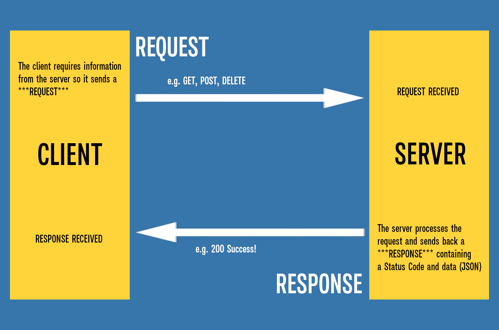
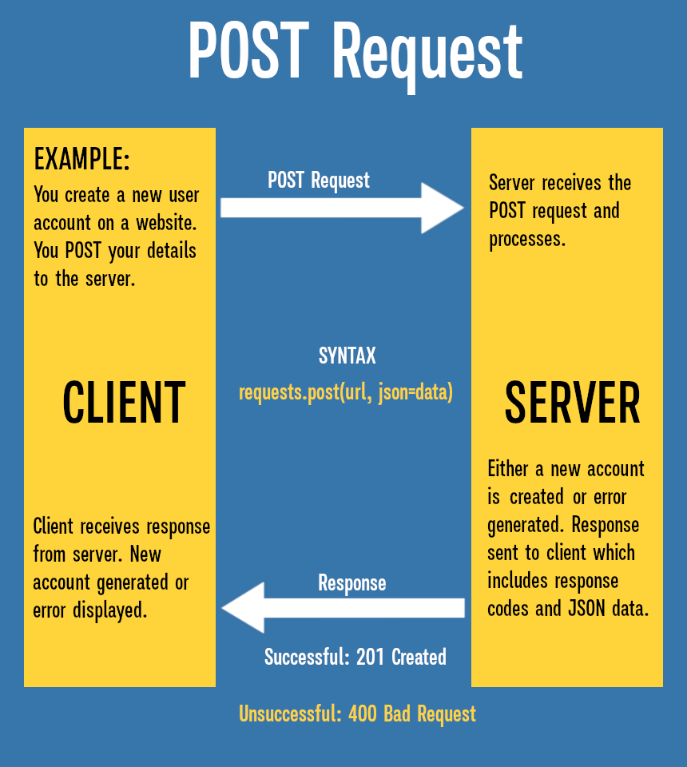
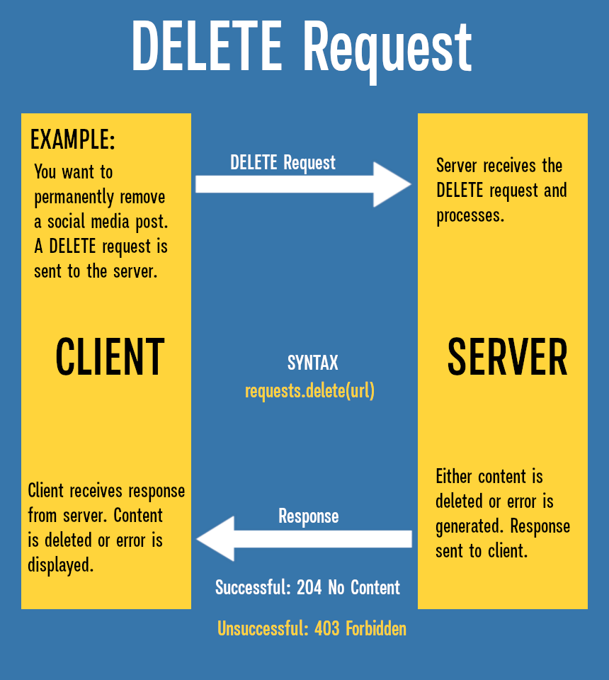

# 🌐 HTTP Basics and `requests` Library Setup

Welcome to the **Advanced Phase!** The first step in interacting with web services is understanding the language of the web: **HTTP** (Hypertext Transfer Protocol). This lesson covers the fundamental concepts of HTTP and how to prepare your Python environment to start making web requests.

## 1. What is HTTP?

HTTP is the protocol used for communication between a **client** (like your browser or a Python script) and a **server** (where a website or API lives). This communication follows a simple request-response cycle:

1.  **Client** sends an **HTTP Request** (e.g., "Give me the data for this URL").
2.  **Server** processes the request and sends back an **HTTP Response** (e.g., the HTML page, JSON data, or an error message).



## 2. Key HTTP Methods (Verbs)

An HTTP **Method** (or **Verb**) tells the server what kind of action the client wants to perform on a resource. The two most common methods are:

| Method   | Purpose                                                                                     | Analogy                                             |
| :------- | :------------------------------------------------------------------------------------------ | :-------------------------------------------------- |
| **GET**  | **Retrieve data** from a specified resource. It should have no side effects on the server.  | **Reading** a book.                                 |
| **POST** | **Submit data** to be processed to a specified resource. This often creates a new resource. | **Writing** a book and sending it to the publisher. |

Other useful methods are:

|            |                              |
| ---------- | ---------------------------- |
| **PATCH**  | Update a specific field      |
| **PUT**    | Update a resource entirely.  |
| **DELETE** | Remove a specified resource. |






## 3. The Importance of HTTP Status Codes

When a server sends a response, it includes a three-digit **Status Code** to tell the client the outcome of the request. Knowing these is essential for debugging and writing robust applications.

| Range   | Meaning          | Example Code                  | Description                                                   |
| :------ | :--------------- | :---------------------------- | :------------------------------------------------------------ |
| **1xx** | Informational    | 100                           | Request received, continuing process. (Rarely seen)           |
| **2xx** | **Success**      | **200 OK**                    | The request was successful. (The goal!)                       |
| **3xx** | Redirection      | 301                           | The resource has permanently moved to a new URL.              |
| **4xx** | **Client Error** | **404 Not Found**             | The resource was not found.                                   |
| **5xx** | **Server Error** | **500 Internal Server Error** | The server encountered an error while processing the request. |

:::note
**Goal:** In Python, a successful request always returns a status code in the **200** range. Anything higher than 299 is viewed as unsuccessful. Anything higher than 399 is an ERROR !
:::

## 4. Setting Up the `requests` Library

While Python has a built-in library for HTTP, the **`requests`** library is the _de facto_ standard due to its simplicity and user-friendliness.

:::note
Since `requests` is a third-party package, you must install it first.
:::

### Step 1: Install `requests`

You use the `pip` package manager (which you learned about in Module 15) to install it:

```bash
# Ensure your virtual environment is active!
pip install requests
```

### Step 2: Basic Import

In your Python script, you simply import it and assign the response to a variable:

```python
import requests

# 1. GET Request: Fetching data (Reading)
get_response = requests.get('https://jsonplaceholder.typicode.com/posts/1')
print(f"GET Status: {get_response.status_code}")

# 2. POST Request: Sending data (Creating)
post_response = requests.post('https://jsonplaceholder.typicode.com/posts', json={'title': 'Learning HTTP'})

print(f"POST Status: {post_response.status_code}")
print(f"Server returned: {post_response.json()}")
```

The `response` object holds all the information, including the status code, content, and headers.

:::note
We send data using **JSON** (JavaScript Object Notation). In Python, we represent this as a dictionary (key-value pairs). When you use the `json=` argument, the `requests` library automatically converts your dictionary into a format the server can understand.
:::

:::summary

- **HTTP** is the protocol for communication between clients and servers
- **HTTP Methods** indicate the desired action: `GET` (retrieve), `POST` (submit), `PUT` (update), `DELETE` (remove)
- **Status Codes** tell you the outcome of a request:
  - `2xx` = Success (200 OK)
  - `4xx` = Client Error (404 Not Found)
  - `5xx` = Server Error (500 Internal Server Error)
- The **`requests`** library is the standard for HTTP in Python (third-party, must be installed)
- Import with `import requests`, then use `requests.get(url)` to make requests
- The response object contains `.status_code`, `.text`, and `.json()` methods
- Always check status codes to handle errors gracefully in your code

:::
