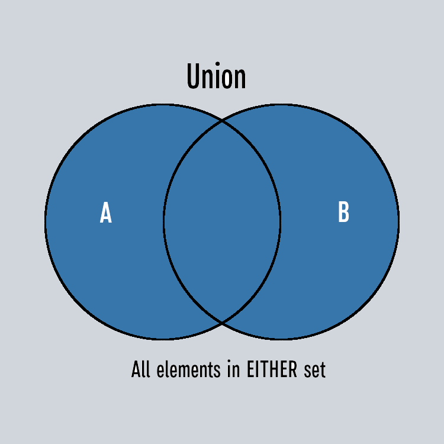
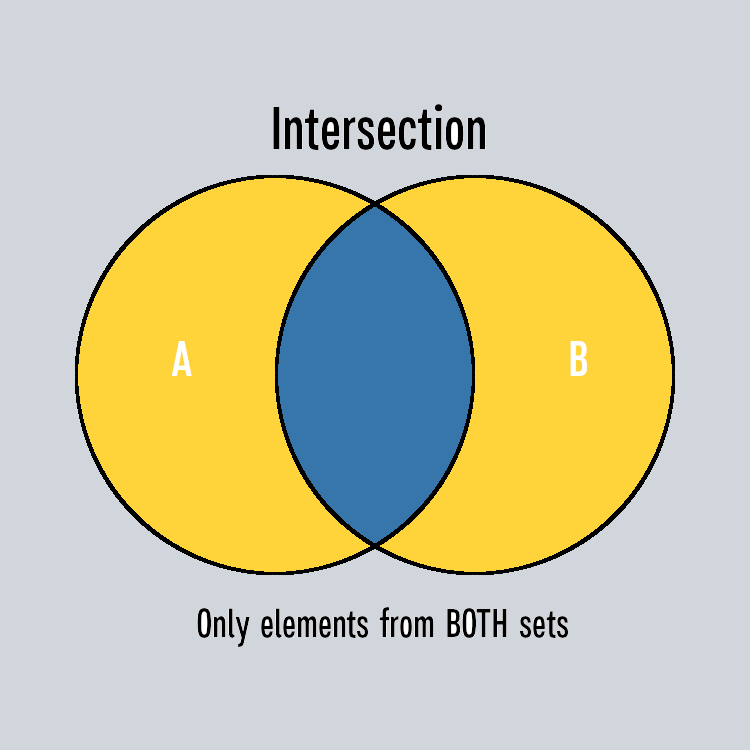
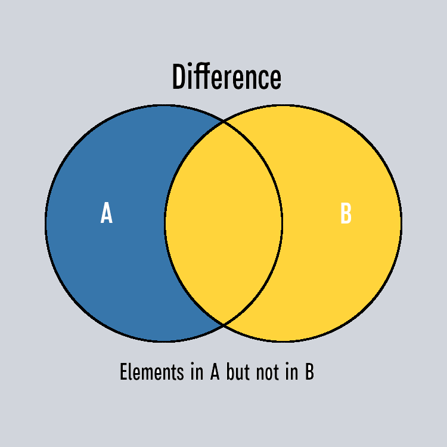
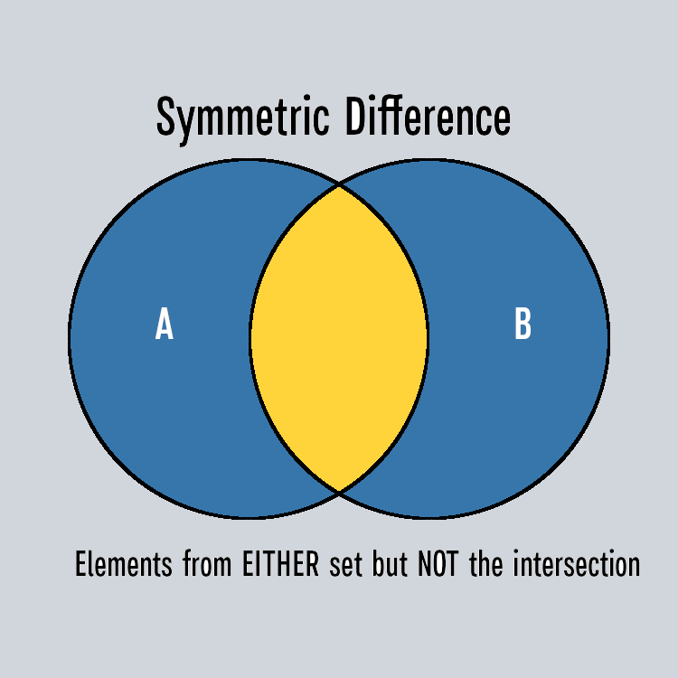

# 🧮 Set Operations: Union, Intersection, and Difference

Sets are unique among Python's data structures because they support mathematical **set theory operations**. These are used to combine or compare two or more sets to produce a new resulting set.

These operations are often visualized using **Venn Diagrams**.

## 1. Union: Combining Sets

The **Union** of two sets includes all elements that are present in **either** set. Duplicates are automatically removed in the final result.



### Syntax: `set1 | set2` or `set1.union(set2)`

```python
# Characters from both Sunnydale and Los Angeles casts S1-3
sunnydale = {"Buffy", "Willow", "Xander", "Giles", "Oz", "Cordelia", "Angel"}
los_angeles = {"Angel", "Cordelia", "Fred", "Gunn", "Doyle", "Wesley"}

# Combine both casts
all_characters = sunnydale | los_angeles
print(all_characters)
# Output: {"Buffy", "Willow", "Xander", "Giles", "Oz", "Cordelia", "Angel",
#          "Fred", "Gunn", "Doyle", "Wesley"}

# Using the method works identically
all_characters_method = sunnydale.union(los_angeles)
```

:::note
Notice how **Angel** and **Cordelia** appear in both original sets, but only once in the _union_ - duplicates are automatically removed. The original sets remain unchanged.
:::

## 2. Intersection: Finding Common Elements

The **Intersection** of two sets includes only the elements that are present in **both** sets.



### Syntax: `set1 & set2` or `set1.intersection(set2)`

```python
# Which characters appeared as main characters in both shows?
sunnydale = {"Buffy", "Willow", "Xander", "Giles", "Oz", "Cordelia", "Angel"}
los_angeles = {"Angel", "Cordelia", "Fred", "Gunn", "Doyle", "Wesley"}

# Find crossover characters
crossover_characters = sunnydale & los_angeles
print(crossover_characters) # Output: {"Angel", "Cordelia"}
```

The intersection gives us only the characters who appeared in both the Sunnydale cast **and** the Los Angeles cast (**Angel** and **Cordelia**).

## 3. Difference: Finding Unique Elements

The **Difference** operation finds elements present in the first set but not in the second set. The order matters!



### Syntax: `set1 - set2` or `set1.difference(set2)`

```python
sunnydale = {"Buffy", "Willow", "Xander", "Giles", "Oz", "Cordelia", "Angel"}
los_angeles = {"Angel", "Cordelia", "Fred", "Gunn", "Doyle", "Wesley"}

# Characters who stayed in Sunnydale (didn't move to LA)
sunnydale_only = sunnydale - los_angeles
print(sunnydale_only) # Output: {"Buffy", "Willow", "Xander", "Giles", "Oz"}

# Characters who were only in Los Angeles (not in Sunnydale as a MAIN character)
los_angeles_only = los_angeles - sunnydale
print(los_angeles_only) # Output: {"Fred", "Gunn", "Doyle", "Wesley"}
```

:::warning
**Order Matters for Difference:** `A - B` gives elements in A but not B. `B - A` gives elements in B but not A. They're not the same! Always double-check which set you're subtracting from.
:::

## 4. Symmetric Difference (Bonus)

The **Symmetric Difference** includes all elements that are in either set, but not in their intersection - essentially, the elements that are unique to each set. Using our data, this gives us the characters who were part of the main cast for one show, but never the other.



### Syntax: `set1 ^ set2` or `set1.symmetric_difference(set2)`

```python
sunnydale = {"Buffy", "Willow", "Xander", "Giles", "Oz", "Cordelia", "Angel"}
los_angeles = {"Angel", "Cordelia", "Fred", "Gunn", "Doyle", "Wesley"}

# Main cast members who were exclusive to their respective series
exclusive_cast = sunnydale ^ los_angeles

print(exclusive_cast)
```

:::tip
Think of Symmetric Difference as the "Anti-Intersection." It finds everyone except the people who belong to both groups.
:::

## 5. Chaining Operations (The Master Class)

You can chain set operations together to solve complex questions in a single line.

**Scenario:** You want to find every character from both shows (_Union_), but you want to filter the list to show **_only the humans_**.

```python
sunnydale = {"Buffy", "Willow", "Xander", "Giles", "Oz", "Cordelia", "Angel"}
los_angeles = {"Angel", "Cordelia", "Fred", "Gunn", "Doyle", "Wesley"}
non_humans = {"Angel", "Doyle"}

# 1. Combine both casts (Union)
# 2. Subtract the non-humans (Difference)
human_characters = (sunnydale | los_angeles) - non_humans

print(human_characters)
# Output: {'Buffy', 'Willow', 'Xander', 'Giles', 'Oz', 'Cordelia', 'Fred', 'Gunn', 'Wesley'}
```

### Why use Parentheses?

In the example above, the parentheses `(sunnydale | los_angeles)` tell Python to combine the characters **first**, and then subtract the `non_humans` from that total.

:::tip
While Python has a specific "order of operations" for sets, always use parentheses `()` to make your code easier for other humans to read. It removes the guesswork!
:::

:::summary

- **Union** (`|` or `.union()`): All elements from both sets
- **Intersection** (`&` or `.intersection()`): Elements common to both sets
- **Difference** (`-` or `.difference()`): Elements in first set but not second
- **Symmetric Difference** (`^` or `.symmetric_difference()`): Elements in either set but not both
- These operations create **new sets** (don't modify originals)
- Visualize with Venn diagrams for clarity
- Order matters for difference: `A - B` ≠ `B - A`

:::
